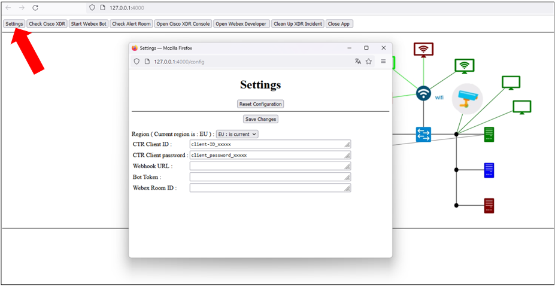

# Webex for XDR demo part 7 - the final demo

This article is the last one of the serie dedicated to use Webex as an alerting system for Cisco XDR.

We put everything together and show the final result.

## Step by Step demo installation

### Step 0 : pre requisits

-	If not already done create an XDR API client ( client-ID and client password ) into your XDR tenant
-	Create a webex bot and copy it’s authentication token
-	From your webex client start a Webex conversation with the Webex Bot

### Step 1 Create XDR Feeds 

[Create Text Public Feeds for firewalls](https://github.com/pcardotatgit/SecureX_Workflows_and_Stuffs/tree/master/12-create_securex_blocking_lists_for_firewalls)

### Step 2 Fill the XDR IP V4 feed with TOR network IP addresses :
[TOR BLOCKING LIST TO IPV4 SECUREX FEEDS](https://github.com/pcardotatgit/SecureX_Workflows_and_Stuffs/tree/master/500-SecureX_Workflow_examples/Workflows/TOR_IP_blocking_list_to_SecureX_feeds)

### Step 3 configure the XDR IPV4 feed URL into the SCA Third Party Watch List

Into your SCA ( XDR Analytics ) tenant, create a new third party watchlist based on the XDR IPv4 feed created above.

For doing so, go to Settings => Alerts => Third Party Watch List and create a new feed . Click on the [ Add External URL ] and use the public URL you got into XDR when you created the IPv4 Feed.

### Step 4 setup the Webex Alerting system

Deploy into your XDR tenant the [XDR_ALERT_CARD_WITH_TARGETS_AND_OBSERVABLES_TO_WEBEX_ROOM](https://github.com/pcardotatgit/webex_for_xdr_part-6_XDR_send_alert_workflow) Incident workflow

### Step 5 Install the XDR lab_simulator-002

[lab_simulator-002 installation](https://github.com/pcardotatgit/lab_simulator-002)

**You are ready to go !**

## The demo flow

**Start the simulator** or open your browser to **http://( simulator IP address ):4000**

**notice :** If you run the simulator on your laptop, the browser opens automatically when you start the flask application.

The first time you run the demo, you have to configure the application settings. Click on the **[Settings]** button on the top left.

Select your region.

CTR client ID, CTR Client password and Bot Token are mandatory. Not the other variables.

Enter the correct values and click on [Save Changes].

**Test the connection to XDR** by cliking on the **[Check Cisco XDR]** button

If something is wrong in the connection, then check the region, CTR client ID and CTR Client password.

Start the Webex Bot by clicking on the **[Start Webex Bot]** button. ( due to technical reason the bot doesn't start with the flask application.

You can check into the flask console that the Webex BOT logic is started. 

**Trigger the Attack**

In this demo we simulate the hacker activity which is to send a malicious patern into an edit field of a formular exposed by a Web Server which is vulnerable to the log4J vulnerability.

By doing this, the hacker is able to make the vulnerable Web Server to connect to a malicious web werver somewhere in the INTERNET, download a malicious piece of code that wil be run by the server into memory.

This is actually what we showcase here. This is an XSS attack that trigger an RCE attack.

The following post on the talos blog explains the attack and gives some examples on paterns that can be used to trigger the attack.

https://blog.talosintelligence.com/apache-log4j-rce-vulnerability/

For the demo we don't run a real attack, but we simulate it and we show what happen behind the scene.

To trigger the attack simulation just click on the hacker icon into the network diagram and you will see the Web Server login formular opens.

Then you can  copy any attack patern from the examples and paste it into any of the formular edit fields and then click on the [ Log In ] Button. Entering something into the edit fields is not mandatory actually, this is just to make the demo realistic.

Then you will see a short video which show the infection. We see the malicious piece of code which is downloaded by the vulnerable web server.
This is actually a powershell script the contains an obfuscated and compressed version of the mimikatz attack code. The code is not saved into the Web Server Disk, it is executed into memory. This is a fileless attack.

Secure Endpoint detect and block this attack instantly.

What is shown in the video, executed manuall is really what happens automatically when the attack occurs. The video is there to help to give soe explaination to the audience.

Within a few second we see that we received an Alert in the Webex Bot Alert room.

This alert contains a message, targeted systems and malicious observables. This is a formular which gives the capability to select objects and either isolate them out from the network, or block them into firewalls ( or in any enforcement point )

At the same time an XDR incident was created. You can go to the XDR Incident managerand see it. And you investigate it.

The demo continues with the Webex Alert formular by selecting the malicious observable and clicking on the **[Block Selected Objects]** Button

A message into the Alert Webex Room confirms us that the IP address was added into the XDR feed.

When can check that by going to the XDR IPv4 Feed and search for the malicious ip address ( 91.109.190.8 ). And we find it into the XDR feed as it was not existing into it before adding it thru the Alert Formular.

Every IP Addresses contained into this XDR are blocked into the company firewalls, and this Feed is consumed as well by XDR Analytics. That means that any connection attempts by other internal machines to this IP address, will be blocked by firewall and is supposed to trigger an  Watchlist alert into SCA.

**End of the demo !!**

## Clean Up demo data

In order to keep the XDR tenant clean and in order to keep the capability to do the demo several times from scratch, you can delete every demo data created by this demo within XDR.

For doing so, from the network diagram, just click on the **[Clean Up Incident]** Button.

  